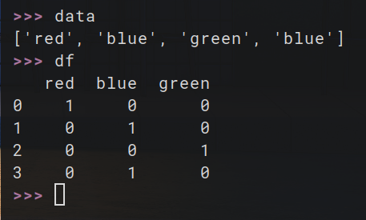

# 🧩 One-Hot Encoding

This mini-project demonstrates a from-scratch implementation of **One-Hot Encoding**, used to convert categorical variables into a binary matrix.

---

## 📌 What is One-Hot Encoding?

One-hot encoding converts each unique category into a new binary feature. Each original category becomes a new column, with `1` indicating presence and `0` otherwise.

---

## 🧮 Example

Original Category:
```
['Red', 'Green', 'Blue']
```

One-Hot Encoded:
```
Red Green Blue
1 0 0
0 1 0
0 0 1
```

---

## 📊 Visualization

The result of one-hot encoding applied to sample data is shown below:


