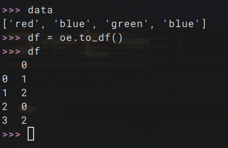

# 🏷️ Ordinal Encoding

This project shows a basic implementation of **Ordinal Encoding**, commonly used when categories have a natural order or ranking.

---

## 📌 What is Ordinal Encoding?

Ordinal encoding maps each category to an integer, preserving the **order** of the categories if it exists.

---

## 🧮 Example

For education levels:
```
['High School', 'Bachelor', 'Master', 'PhD']
→ {'High School': 0, 'Bachelor': 1, 'Master': 2, 'PhD': 3}
```


---

## 📊 Visualization

The result of ordinal encoding applied to ordered categories is shown here:


