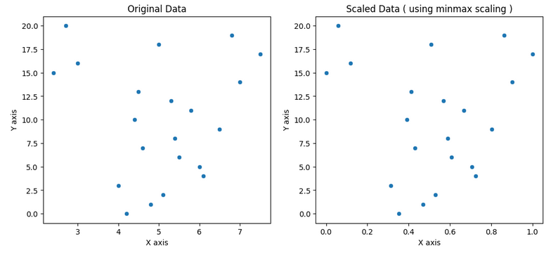

# 📐 Min-Max Scaling (Feature Scaling)

This mini-project demonstrates the implementation of **Min-Max Scaling** from scratch, including visualization of its effect on feature distribution.

---

## 📌 What is Min-Max Scaling?

Min-Max Scaling transforms features by scaling each feature to a given range — usually between **0 and 1**.

It is sensitive to **outliers**, since it uses the **minimum** and **maximum** values in the feature to perform the transformation.

---

## 🧮 Formula

$X_{\text{scaled}} = \frac{X - X_{\text{min}}}{X_{\text{max}} - X_{\text{min}}}$

---

## 📊 Visualization

The following plot shows the original vs scaled data:

