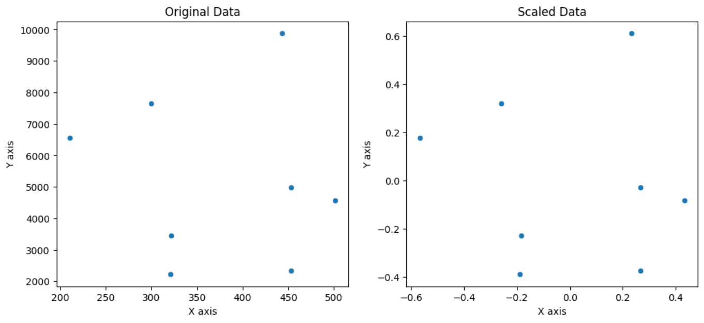

# ⚖️ Normalization (Vector Scaling)

This mini-project implements **L2 normalization** from scratch to transform feature vectors to unit norm.

---

## 📌 What is Normalization?

Normalization refers to scaling individual samples to have **unit norm**. This is especially useful when training models that rely on the **magnitude of the vectors**, like **KNN** or **cosine similarity**-based models.

---

## 🧮 Formula (L2 Normalization)

$X_{\text{normalized}} = \frac{X}{\|X\|_2} = \frac{X}{\sqrt{\sum x_i^2}}$

Each sample (row vector) is scaled to have a length of **1**.

---

## 📊 Visualization

The plot below shows the effect of normalization on the sample vectors:

