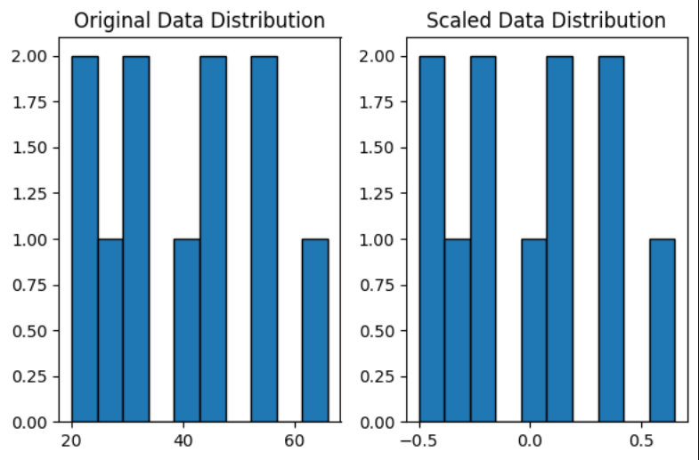

# 🛡️ Robust Scaling (Feature Scaling)

This mini-project showcases a custom implementation of **Robust Scaling**, which is particularly useful for handling **outliers**.

---

## 📌 What is Robust Scaling?

Robust Scaling scales features using statistics that are **robust to outliers**, namely the **median** and the **interquartile range (IQR)**.

This makes it more stable and reliable for datasets that are not normally distributed or contain extreme values.

---

## 🧮 Formula

$X_{\text{scaled}} = \frac{X - \text{Median}(X)}{\text{IQR}(X)}$

Where:
- **IQR = Q3 - Q1**

---

## 📊 Visualization

The following plot compares the distribution before and after robust scaling:

