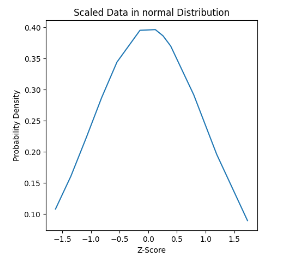

# 📊 Standard Scaling (Z-score Normalization)

This mini-project includes a custom implementation of **Standard Scaling**, also known as **Z-score normalization**, along with visual results.

---

## 📌 What is Standard Scaling?

Standard Scaling standardizes the features by removing the **mean** and scaling to **unit variance**. It's widely used when data follows a Gaussian-like distribution and is essential for many machine learning algorithms.

---

## 🧮 Formula

$X_{\text{scaled}} = \frac{X - \mu}{\sigma}$

Where:
- $\(\mu\)$ is the **mean** of the feature  
- $\(\sigma\)$ is the **standard deviation**

This transformation centers the data around **0** with a standard deviation of **1**.

---

## 📊 Visualization

The plot below visualizes how data is standardized:

