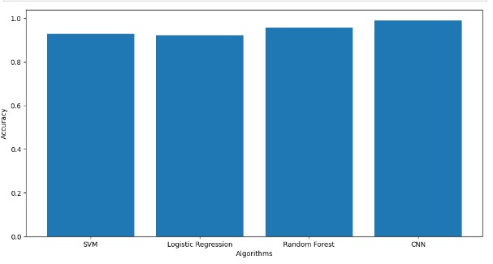

# 🔢 Handwritten Digit Recognition

This project explores and compares multiple machine learning models to classify **handwritten digits (0–9)** using the classic **MNIST dataset**.

---

## 📌 Project Overview

- **Goal**: Recognize handwritten digits from images
- **Dataset**: MNIST (Modified National Institute of Standards and Technology database)

---

## 🧠 Algorithms & Accuracy

A range of models were trained and evaluated. Below are the accuracy scores:

| Algorithm            | Accuracy   |
|----------------------|------------|
| SVM                  | 92.80%     |
| Logistic Regression  | 92.21%     |
| Random Forest        | 95.86%     |
| Convolutional Neural Network (CNN) | **98.99%** |

---

## 📊 Results

The following plot visualizes the accuracy comparison between the different models:

