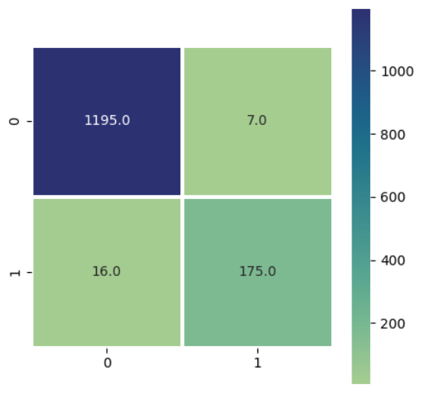

# 📧 Spam Email Classifier

This project focuses on detecting **spam messages** using a simple and effective machine learning approach. The model is trained using the **Multinomial Naive Bayes** algorithm on the **SMS Spam Collection Dataset**.

---

## 📌 Project Overview

- **Goal**: Classify SMS messages as *spam* or *ham* (non-spam)
- **Model Used**: Multinomial Naive Bayes
- **Accuracy Achieved**: **98.35%**

---

## 📊 Results

The model performs with high accuracy and minimal misclassifications. Below is the confusion matrix visualized for better understanding:

---

## 🛠️ Tools & Libraries

- Python
- Pandas
- Scikit-learn
- TfidfVectorizer
- Matplotlib / Seaborn (for visualization)

---

## 📂 Files Included

- `spam_mail.ipynb` — main notebook containing preprocessing, training, evaluation
- `plot.png` — confusion matrix visualization
- `spam.csv` — CSV file Dataset

---

## 🔍 Dataset Source

- [SMS Spam Collection Dataset - UCI ML Repository](https://archive.ics.uci.edu/ml/datasets/sms+spam+collection)

