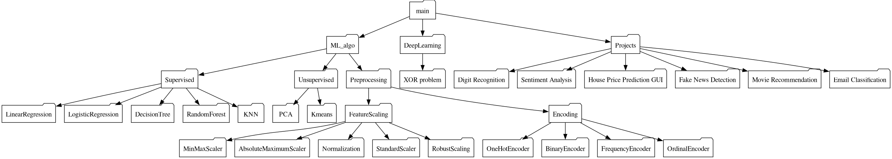

# MLDL-Algorithms  
A structured repository containing fundamental implementations of **Machine Learning** and **Deep Learning** algorithms from scratch. Covers **supervised, unsupervised, preprocessing techniques**, and deep learning architectures with minimal external dependencies.  

---

## 📌 Table of Contents  
- [Introduction](#introduction)  
- [Repository Structure](#repository-structure)  
- [Implemented Algorithms](#implemented-algorithms)  
- [How to Use](#how-to-use)  
- [Future Plans](#future-plans)  
- [References](#references)  

---
<a id="introduction"></a>
## 🔥 Introduction  
This repository serves as a **personal research and implementation hub** for ML & DL algorithms, covering:  
✅ **Supervised Learning** (Regression, Decision Trees, Random Forest, KNN, etc.)  
✅ **Unsupervised Learning** (PCA, K-means Clustering, etc.)  
✅ **Preprocessing Techniques** (Feature Scaling, Encoding Methods)  
✅ **Deep Learning Basics** (Neural Networks, XOR Problem, CNNs, etc.)  
✅ **Projects** (Digit Recognition, Sentiment Analysis, etc.)  

The goal is to provide **hands-on implementations** of these concepts without relying heavily on libraries like Scikit-learn and TensorFlow for core algorithms.  

---

<a id="repository-structure"></a>
## 🏗 Repository Structure  

The repository is structured into different sections:  

📂 **ML Algorithms** → Covers Supervised, Unsupervised Learning, and Preprocessing  
📂 **Deep Learning** → Covers fundamental neural network implementations  
📂 **Projects** → Hands-on applied ML/DL projects  

**Graphical Representation:**  

  

---
<a id="implemented-algorithms"></a>

## 🛠 Implemented Algorithms  

### ✅ **Supervised Learning**  
✔️ Linear Regression  
✔️ Logistic Regression  
✔️ Decision Tree  
✔️ Random Forest  
✔️ K-Nearest Neighbors (KNN)  

### ✅ **Unsupervised Learning**  
✔️ Principal Component Analysis (PCA)  
✔️ K-Means Clustering  

### ✅ **Preprocessing Techniques**  
✔️ Feature Scaling: MinMaxScaler, StandardScaler, Normalization  

### ✅ **Deep Learning Implementations**  
✔️ XOR Problem (Basic Neural Network)  

### ✅ **Projects**  
✔️ Digit Recognition  
✔️ House Price Prediction (GUI-based)  

---

<a id="how-to-use"></a>
## 🚀 How to Use  

Clone the repository:  
```bash

git clone https://github.com/yourusername/MLDL-Algorithms.git
cd MLDL-Algorithms
```
---

<a id="future-plans"></a>
## Future Plans
- Fake News Detection
- CNN Architecture
- Sentiment Analysis
=======
